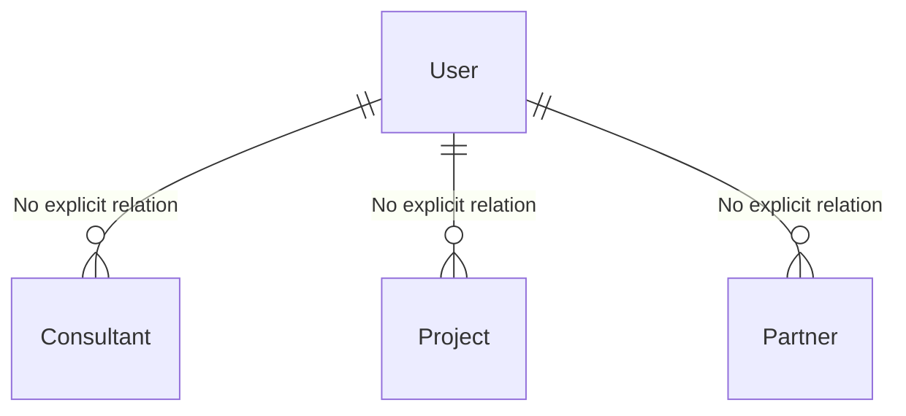

# DaFourLance Dashboard — Engineering Audit Report

## 1. Project Overview
- **Product:** منصة إلكترونية للشركة (DaFourLance) تعمل كموقع تعريفي ثنائي اللغة، مع لوحة تحكم CMS داخلية لإدارة المحتوى، وبوت ذكاء اصطناعي (Smart Assistant) للإجابة على استفسارات الزوار.
- **Target Users:** زوار الموقع (عملاء محتملون)، ومديرو النظام (Admins) الذين يديرون المحتوى.
- **Language:** تطبيق ثنائي اللغة (Bilingual)، لغته الأساسية العربية (RTL) ويدعم الإنجليزية (LTR). لا يعتمد على مكتبة i18n معيارية بل يستخدم حقول قاعدة بيانات مزدوجة (مثل `titleAr`, `titleEn`).
- **Maturity:** المشروع يبدو في مرحلة MVP أو POC متقدم، يتهيأ للنشر عبر منصة CapRover.

## 2. Tech Stack الفعلي

| Layer | Tech | Version | Notes |
|-------|------|---------|-------|
| Framework | Next.js (App Router) | 16.0.10 | إصدار متقدم (ربما Canary أو حديث جداً وقت التأسيس) |
| UI/Library | React | 19.2.0 | |
| Styling | Tailwind CSS | v4.1.9 | يعتمد على PostCSS plugin |
| UI Components | shadcn/ui | Radix | `new-york` style، مدعوم بـ Lucide icons |
| ORM | Prisma | 5.22.0 | |
| Database | SQLite | - | محلي وفي الإنتاج |
| AI Integration| Vercel AI SDK | ^6.0.5 | مع `@openrouter/ai-sdk-provider` للمزود |
| Auth | Custom JWT/Cookies | - | يعتمد على `bcryptjs` وتشفير مخصص للـ Session |

**ملاحظات المخاطر التقنية:**
- تضارب صارخ في إدارة الحزم: المستودع يحوي `pnpm-lock.yaml` و `pnpm-workspace.yaml`، لكن الـ `Dockerfile` يستخدم `npm install`، مما سيؤدي إلى تجاهل شجرة الاعتمادات المقفلة واحتمال فشل البناء مستقبلاً.
- الاعتماد على `latest` في `@emotion/is-prop-valid: "latest"` يشكل خطراً عند كسر التوافقية (Breaking Changes).

## 3. شجرة المجلدات (Annotated)

```text
/
├── app/                  # Next.js App Router (Pages, Layouts, API, Admin)
│   ├── actions/          # Server Actions (e.g., submit-contact.ts)
│   ├── admin/            # لوحة تحكم الإدارة (CMS)
│   └── api/              # Route Handlers (ai-chat, upload)
├── components/           # مكونات React (Client/Server)
│   ├── admin/            # مكونات لوحة التحكم
│   └── ui/               # مكونات shadcn/ui الخام (Raw)
├── hooks/                # Custom React Hooks (use-mobile, use-toast)
├── lib/                  # Utilities, Auth logic, Prisma DB Client, AI Setup
│   ├── ai/               # AI integrations (ask-ai.ts)
│   └── cms/              # CMS logic (if any)
├── prisma/               # Schema و SQLite database file
├── public/               # Static Assets
│   └── uploads/          # مسار حفظ الصور المرفوعة محلياً
└── scripts/              # سكربتات مساعدة (seed.js للبذر)
```

## 4. Routing Map

| Path | Type | Auth required? | Dynamic params | الملف |
|------|------|----------------|----------------|-------|
| `/` | Page | No | No | `app/page.tsx` |
| `/admin` | Layout | Yes (Partial) | No | `app/admin/layout.tsx` |
| `/admin/login` | Page | No | No | `app/admin/login/page.tsx` |
| `/admin/*` | Pages | Yes | No | `app/admin/.../page.tsx` |

**ملاحظات التوجيه (Routing):**
- لا يوجد `middleware.ts` في جذر المشروع.
- الـ `app/admin/layout.tsx` يستدعي `getSession()`. إذا لم يجد جلسة، يمرر الـ `children` (يسمح بعرض صفحة تسجيل الدخول)، لكن حماية الصفحات الداخلية تعتمد على استدعاء `requireAuth()` داخل كل صفحة، وهو نمط قابل للخطأ (Missing per-page guard).

## 5. Data Model (Prisma)

**File:** `prisma/schema.prisma`

```prisma
generator client {
  provider = "prisma-client-js"
}

datasource db {
  provider = "sqlite"
  url      = env("DATABASE_URL")
}

// 🔐 إدارة المستخدمين
model User {
  id        String   @id @default(cuid())
  email     String   @unique
  password  String
  name      String?
  role      String   @default("admin")
  createdAt DateTime @default(now())
  updatedAt DateTime @updatedAt
}

// 👨‍🏫 نموذج المستشارين
model Consultant {
  id            String   @id @default(cuid())
  nameAr        String
  nameEn        String
  roleAr        String
  roleEn        String
  descriptionAr String?
  descriptionEn String?
  imageUrl      String?
  isFeatured    Boolean  @default(false)
  order         Int      @default(0)
  isActive      Boolean  @default(true)
  createdAt     DateTime @default(now())
  updatedAt     DateTime @updatedAt
}

// 🏗️ نموذج المشاريع
model Project {
  id                 String   @id @default(cuid())
  titleAr            String
  titleEn            String
  shortDescriptionAr String
  shortDescriptionEn String
  fullDescriptionAr  String? 
  fullDescriptionEn  String?  
  categoryAr         String?
  categoryEn         String?
  imageUrl           String
  galleryImages      String? 
  ctaLabelAr         String   @default("عرض التفاصيل")
  ctaLabelEn         String   @default("View Details")
  ctaLink            String?
  order              Int      @default(0)
  isActive           Boolean  @default(true)
  createdAt          DateTime @default(now())
  updatedAt          DateTime @updatedAt
}

// 🤝 نموذج الشركاء
model Partner {
  id         String   @id @default(cuid())
  nameAr     String
  nameEn     String
  logoUrl    String
  websiteUrl String?
  order      Int      @default(0)
  isActive   Boolean  @default(true)
  createdAt  DateTime @default(now())
  updatedAt  DateTime @updatedAt
}

// 🔗 نموذج روابط التنقل
model NavItem {
  id         String   @id @default(cuid())
  labelAr    String
  labelEn    String
  href       String
  order      Int      @default(0)
  isVisible  Boolean  @default(true)
  isExternal Boolean  @default(false)
  createdAt  DateTime @default(now())
  updatedAt  DateTime @updatedAt
}

// 📝 نموذج النصوص الثابتة
model SiteText {
  id        String   @id @default(cuid())
  key       String   @unique
  headingAr String?
  headingEn String?
  bodyAr    String?
  bodyEn    String?
  extraJson String?
  createdAt DateTime @default(now())
  updatedAt DateTime @updatedAt
}

// --- 🌟 النماذج الجديدة المضافة من v0 ---

// 📱 إعدادات تذييل الصفحة (Footer)
model FooterConfig {
  id            String   @id @default(cuid())
  phone         String?
  phone2        String?
  email         String?
  whatsapp      String?
  addressAr     String?
  addressEn     String?
  linkedinUrl   String?
  twitterUrl    String?
  youtubeUrl    String?
  instagramUrl  String?
  facebookUrl   String?
  descriptionAr String?
  descriptionEn String?
  copyrightAr   String?
  copyrightEn   String?
  isActive      Boolean  @default(true)
  createdAt     DateTime @default(now())
  updatedAt     DateTime @updatedAt
}

// 📞 معلومات التواصل في صفحة الاتصال
model ContactInfo {
  id         String   @id @default(cuid())
  phone      String?
  phone2     String?
  email      String?
  whatsapp   String?
  addressAr  String?
  addressEn  String?
  titleAr    String?
  titleEn    String?
  subtitleAr String?
  subtitleEn String?
  isActive   Boolean  @default(true)
  createdAt  DateTime @default(now())
  updatedAt  DateTime @updatedAt
}

// 📩 رسائل الزوار المستلمة
model ContactMessage {
  id        String   @id @default(cuid())
  firstName String
  lastName  String
  email     String
  phone     String?
  message   String
  isRead    Boolean  @default(false)
  createdAt DateTime @default(now())
  updatedAt DateTime @updatedAt
}

// 🖼️ سجل الصور المرفوعة
model UploadedImage {
  id        String   @id @default(cuid())
  filename  String
  url       String
  mimeType  String?
  size      Int?
  category  String? 
  entityId  String?
  createdAt DateTime @default(now())
  updatedAt DateTime @updatedAt
}

// ⚙️ إعدادات النظام (مفتاح OpenAI وغيرها)
model SystemSettings {
  id        String   @id @default("singleton")
  openAiKey String?
  updatedAt DateTime @updatedAt
}

// 🤖 AI Knowledge Base — dynamic context for the chatbot
model AiKnowledgeBase {
  id String @id @default("singleton")

  // About the company
  aboutAr String @default("")
  aboutEn String @default("")

  // Services offered
  servicesAr String @default("")
  servicesEn String @default("")

  // Features and highlights
  featuresAr String @default("")
  featuresEn String @default("")

  // Pricing info (optional)
  pricingAr String @default("")
  pricingEn String @default("")

  // FAQ / Common questions
  faqAr String @default("")
  faqEn String @default("")

  // Extra custom context (flexible field)
  extraAr String @default("")
  extraEn String @default("")

  // AI behavior instructions (appended to system prompt)
  behaviorInstructionsAr String @default("")
  behaviorInstructionsEn String @default("")

  updatedAt DateTime @updatedAt
}

// 📦 أقسام قاعدة المعرفة الديناميكية — CRUD
model AiKnowledgeSection {
  id        String   @id @default(cuid())
  icon      String   @default("📌")
  titleAr   String
  titleEn   String
  contentAr String   @default("")
  contentEn String   @default("")
  order     Int      @default(0)
  createdAt DateTime @default(now())
  updatedAt DateTime @updatedAt
}
```


**عيوب التصميم وقاعدة البيانات:**
- **غياب العلاقات (No Relations):** المخطط يفتقر بالكامل إلى علاقات مفتاح أجنبي (Foreign Keys). نموذج `UploadedImage` يحوي `entityId` لكنه حقل نصي عادي وليس رابطاً (Relation) مع الموديلات الأخرى.
- **Enums مفقودة:** حقل `role` في `User` يستخدم نوع `String` بدلاً من `enum`، بسبب قيود SQLite المبدئية، لكن يمكن محاكاتها برمجياً.
- **Seeding:** ملف `scripts/seed.js` يستخدم `upsert` لتهيئة البيانات، وهو (Idempotent)، لذا البذر المتكرر آمن.

## 6. API Surface

| Path / Function | Method | Input | Output | Auth Required? | Consumer |
|-----------------|--------|-------|--------|----------------|----------|
| `/api/ai-chat` | POST | `{ message, history, language }` | `{ reply }` أو `{ error }` | No | Frontend Bot Component |
| `/api/upload` | POST | `FormData (file, category)` | `{ url, filename }` | Yes (getSession) | Admin Dashboard Uploads |
| `submitContactForm` | Server Action | `FormData` | `{ success, error }` | No | Contact Form |

## 7. Auth & Sessions
- **الآلية:** نظام مصادقة منزلي (Custom) يعتمد على الجلسات في الكوكيز (`admin_session`) مع تحقق من سلامة البيانات عبر تشفير يشبه (HMAC) بـ `crypto.subtle`.
- **التجزئة (Hashing):** يستخدم `bcryptjs` بقوة (Cost) = 12، مع وجود طبقة تهاجر (Migration) صامتة للتجزئة القديمة (SHA-256).
- **الحماية:** لا يوجد Middleware مركزي. الكود يعتمد على استدعاء `requireAuth()` يدوياً في كل واجهة مسار داخل الـ `app/admin`.
- **الأمان:** الكوكيز مجهزة بـ `HttpOnly: true` و `sameSite: "lax"`. لا يوجد تطبيق لآلية CSRF. لا توجد صلاحيات متعددة مُطبقة فعلياً رغم وجود حقل `role` بالداتابيز.

## 8. AI Bot (الميزة الحرجة)
- **المزود:** OpenRouter باستخدام `@openrouter/ai-sdk-provider`.
- **الموديل الافتراضي:** `openrouter/free` ويمكن تمريره برمجياً.
- **التخزين:** لا توجد قاعدة بيانات لتخزين المحادثات. المحادثات تعيش حصراً في حالة الـ Client (`history` array)، مما يعني أنها تُمحى تلقائياً عند إعادة تحميل الصفحة.
- **التسريب/المخاطر:** لا يوجد Rate Limiting من جهة السيرفر، مما يترك السيرفر عُرضة لاستنفاد رصيد الـ API إذا تم إرسال طلبات متكررة.

## 9. Frontend Architecture
- **المكونات:** استخدام مكثف لـ `"use client"` في مجلد `components/` مما يعني أن التفاعل يتم بشكل كبير من جهة العميل.
- **جلب البيانات:** الاعتماد على Prisma لجلب البيانات محلياً في الـ Server Components، واستخدام Server Actions لتمريرها للعميل عند الحاجة (مثل النماذج).
- **إدارة الحالة:** تعتمد بشكل أساسي على State محلي (React `useState`).

## 10. UI/Design System
- **التصميم:** مبني على `shadcn/ui` و `Tailwind v4` مع استخدام الـ CSS Variables للسمات (Themes) الداكنة والفاتحة في `globals.css`.
- **الخطوط والاتجاه:** يدعم الـ RTL في ملف `globals.css` باستخدام Selector `[dir="rtl"]`.
- **الألوان:** لوحة ألوان مخصصة (`--primary: #fe6a52`).

## 11. Security Audit (Severity-ranked)

1. **Severity: Critical | Effort: S**
   - **الخطر:** إهمال أخطاء Typescript. ملف `next.config.mjs` يعين `typescript.ignoreBuildErrors: true`.
   - **الدليل:** `next.config.mjs:4`.
   - **التخفيف:** إيقاف هذا الخيار وإصلاح أخطاء النوع (Typing) لضمان بيئة إنتاج مستقرة.

2. **Severity: High | Effort: M**
   - **الخطر:** حماية الصفحات يدوية. عدم وجود `middleware.ts` لحماية المسار `/admin/*` يعرض النظام لاحتمالية تسريب بيانات لو نسي المطور استدعاء `requireAuth()`.
   - **الدليل:** `app/admin/layout.tsx:16-22`.
   - **التخفيف:** إنشاء `middleware.ts` يمنع الوصول لمجلد `/admin` (عدا الـ login) إلا بكوكي صالح.

3. **Severity: Medium | Effort: S**
   - **الخطر:** رفع الملفات إلى مسار محلي. الدالة `api/upload/route.ts` تحفظ الصور في `public/uploads`. في بيئة `CapRover`، سيتم حذفها مع كل نشر إذا لم يُعرف الـ Volume.
   - **الدليل:** `app/api/upload/route.ts:70`.
   - **التخفيف:** التأكيد على تجهيز Volumes في النشر.

## 12. Performance & Scalability
- **الصور:** ملف `next.config.mjs` يلغي تحسين الصور `images.unoptimized: true`. ربما لسبب توافقي مع `CapRover`، لكنه يزيد حجم الصفحة بشكل كبير للمستخدم النهائي.
- **قاعدة البيانات:** الاعتماد على SQLite جيد للمشاريع الصغيرة، ولكن مع `CapRover` يُشكل تحدياً للمزامنة في حاويات متعددة. يجب استخدام حاوية واحدة فقط.

## 13. Build / Deploy / Ops
- **تضارب الاعتمادات:** 
  **File:** `Dockerfile:5`
  ```dockerfile
  RUN npm install
  ```
  *الملاحظة:* المستودع يستخدم `pnpm` ولكن الدوكر يستخدم `npm`.
- **فقدان البيانات:** كما يشير التعليق في `Dockerfile`، يتطلب النشر ربط `VOLUME /app/prisma` لضمان عدم ضياع قاعدة البيانات SQLite.
- **عملية النشر:** السكربت `npx prisma migrate deploy && npx prisma db seed && npm start` يعمل عند بدء الحاوية. جيد لضمان وجود البيانات.

## 14. Code Quality
- **تعطيل صامت لـ ESLint:** يوجد أمر `"lint": "eslint ."` في `package.json` لكن لا توجد أداة eslint محملة في قائمة التبعيات.
- **غياب الاختبارات (Tests):** لا يوجد إطار اختبار (Jest / Vitest).

## 15. Cross-reference مع `Editing.txt`

| البند | الحالة الحالية | الملفات المعنية | Effort / خطوة التنفيذ |
|-------|----------------|-----------------|----------------------|
| تعديل الفوتر (جهات الاتصال) | جاهز جزئياً (الموديل `FooterConfig` والـ Seed موجود) | `app/admin/footer` | **S**: ربط واجهة الإدارة ببيانات الموديل وعرضها. |
| حذف زر التفاصيل وتوسيط الكاردات | لم يُنفذ بعد | `components/projects.tsx`, `consultants.tsx` | **S**: تعديل الـ JSX/Tailwind classes. |
| رفع صور للأقسام من الجهاز | الواجهة موجودة (`/api/upload`) | مكونات الـ Admin | **M**: استهلاك الـ Upload API في نماذج إضافة (مشاريع/شركاء). |
| Dialog box لتفاصيل المشاريع | موجود مكون (`project-detail-dialog.tsx`) | `components/project-detail-dialog.tsx` | **S**: ربط بيانات CMS بالمكون. |
| مسح محادثات البوت عند إغلاق/تحديث | **مُنفذ تلقائياً** (لا يوجد حفظ محلي) | `components/smart-assistant.tsx` | **S**: لا شيء لتنفيذه (الحالة React state). |
| Hover tooltip للمساعد الذكي | لم يُنفذ بعد | `components/smart-assistant.tsx` | **S**: تغليف الزر بمكون Tooltip من shadcn. |

## 16. Top Risks (مرتبة)

1. **فقدان قاعدة البيانات عند النشر** | الأثر: Critical | الاحتمالية: High | `Dockerfile:23` | يجب ربط Persistent Volume بقوة في CapRover لـ `/app/prisma`.
2. **تخطي أخطاء Typescript** | الأثر: High | الاحتمالية: Certain | `next.config.mjs:4` | إزالة `ignoreBuildErrors: true` لتجنب أعطال رنتايم صامتة.
3. **عدم حماية كاملة للمسارات (Route Guards)** | الأثر: High | الاحتمالية: Medium | `app/admin/layout.tsx` | إنشاء `middleware.ts`.
4. **تلف البناء بسبب NPM vs PNPM** | الأثر: Medium | الاحتمالية: Medium | `Dockerfile:5` | استبدال `npm install` بـ `pnpm install` في الـ Dockerfile.
5. **استنزاف أرصدة OpenRouter** | الأثر: Medium | الاحتمالية: Low | `app/api/ai-chat/route.ts` | إضافة Rate limiting باستخدام Upstash/Redis أو خوارزمية محلية.

---

## HANDOFF SUMMARY FOR AI AGENT

- **المنتج:** منصة شركة رقمية (DaFourLance) مبنية بـ Next.js مع لوحة تحكم CMS داخلية لتمكين الإدارة من التحكم بالمحتوى، مع مساعد ذكي مدمج يعتمد على OpenRouter.
- **البنية:** تطبيق Next.js App Router يعتمد بنسبة كبيرة على Server Actions للتعامل مع قاعدة البيانات SQLite عبر Prisma. واجهات العميل مبنية بـ Tailwind v4 و shadcn/ui. التوجيه (Routing) يعتمد على استدعاء حماية يدوي (No global middleware). الرفع للصور يتم كملفات ثابتة محلياً (Local FS) باستخدام مسار `/public/uploads`. نموذج قاعدة البيانات يفتقر إلى قيود العلاقات (Foreign Keys).

**جدول ملفات "ابدأ من هنا":**
| الملف | الوصف |
|-------|-------|
| `prisma/schema.prisma` | المرجع الوحيد لشكل البيانات في النظام. |
| `app/admin/layout.tsx` | نقطة انطلاق لوحة التحكم ومنطقة فحص تسجيل الدخول الأولي. |
| `lib/auth.ts` | يحتوي على النظام المخصص لإدارة الـ Sessions وتشفير كلمة المرور. |
| `app/api/ai-chat/route.ts` | المحرك الأساسي لعمل المساعد الذكي. |
| `app/api/upload/route.ts` | نقطة الرفع للصور وتتطلب Auth. |
| `scripts/seed.js` | مصدر فهم البيانات الافتراضية للنظام (Idempotent seed). |
| `app/globals.css` | يحتوي على تعريفات Tailwind v4 (via @theme). |

**3 Mental Models ضرورية:**
1. **الـ Auth لا يعتمد على Middleware:** لا تفترض أن أي مسار تحت `/admin` محمي تلقائياً. يجب استدعاء `requireAuth()` داخل الـ Page/Action المعني.
2. **العلاقات وهمية (Implicit):** في Prisma هنا، يتم التعبير عن ارتباط الصور بالكيانات عبر حقل نصي (`entityId`) دون بناء علاقة (Relation) فعلية بين الجداول.
3. **RTL First:** التصميم والمسافات تعتمد على أن اللغة الأساسية عربية، والترجمة مجرد تبديل لمفتاح الحقل في الـ DB (مثل `titleAr` مقابل `titleEn`).

**5 Gotchas غير بديهية:**
1. ملفات المشاريع مُدارة بـ `pnpm` محلياً، لكن الإنتاج (`Dockerfile`) يستخدم `npm install` مما يهدد بتثبيت نسخ اعتمادات مختلفة.
2. حقل الـ `ignoreBuildErrors: true` موجود في إعدادات Next.js؛ الكود الذي يبدو أنه يمتلك Type Errors سيتم بناؤه وتجاهله بصمت.
3. البوت الذكي يفقد ذاكرته عند التحديث (وهو المطلب رقم 5) فلا داعي للبحث عن منطق "حذف" إضافي.
4. الرفع لا يستخدم Cloudinary بل يحفظ في مجلد `public/uploads` المحلي (وهذا يتطلب Volume في CapRover).
5. ملف الـ DB `prisma/dev.db` مستثنى من Git، وSQLite في بيئة `CapRover` تعني الحاوية الواحدة (Single Replica) إلزامية.

**أسئلة مفتوحة للاستيضاح من المالك:**
- هل أنت على دراية بمخاطر استخدام `npm install` في بيئة تحتوي `pnpm-lock.yaml`؟
- هل المطلوب بناء Middleware عام للـ Admin Dashboard بدلاً من الحماية اليدوية المتفرقة؟
- هل ميزانية OpenRouter API محمية بحواجز في حسابكم الخارجي لعدم وجود Rate Limiting داخلي؟
